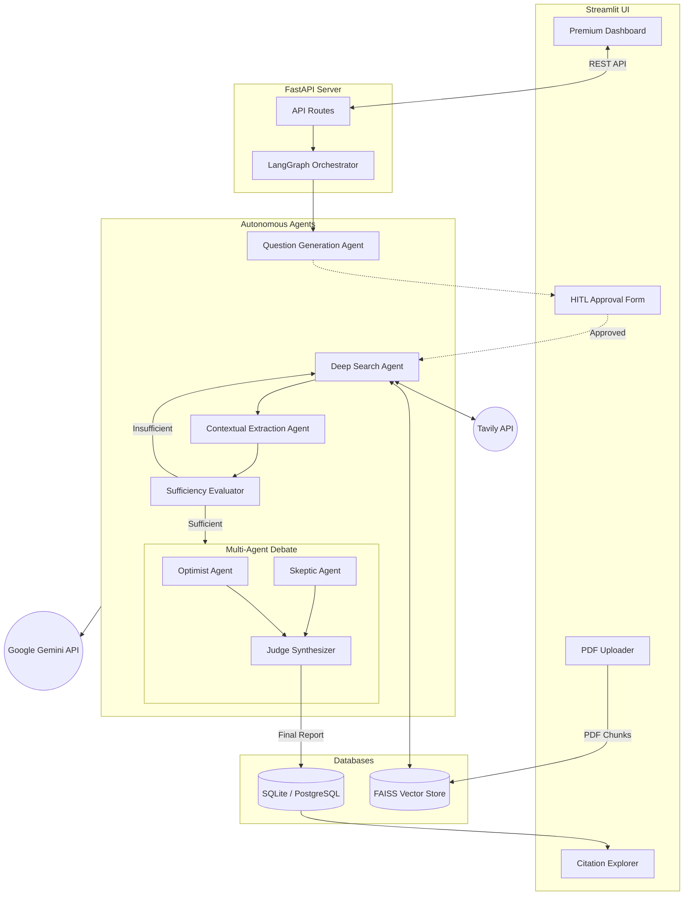

# Nexus AI Research 🧠


**Nexus AI Research** is an enterprise-grade, multi-agent autonomous research system. Designed to emulate the depth and rigor of human analysts, it leverages LangGraph for cyclic agent workflows, Multi-Modal RAG for private document integration, and a unique Multi-Agent Debate architecture to synthesize highly balanced, hallucination-free reports.

---

## 🌟 Key Features

- **Multi-Agent Debate Synthesis**: Reports are not generated by a single LLM. Instead, an **Optimist Agent** and a **Skeptic Agent** debate the findings, while a **Judge Agent** synthesizes their arguments into a perfectly balanced final report.
- **Strict Citation Traceability**: Every claim made in the final report is strictly linked to an exact text snippet extracted from the source, verifiable in the dedicated "Citation Explorer" UI.
- **Human-in-the-Loop (HITL)**: The autonomous pipeline pauses after generating its research plan (sub-questions), allowing the user to steer or approve the research direction before the costly web scraping begins.
- **Multi-Modal RAG**: Upload private enterprise documents (PDFs) to the persistent FAISS vector store. The agents will simultaneously query the live internet and your private knowledge base to form conclusions.
- **Cyclic Web Scraping**: Powered by LangGraph and Tavily, the system dynamically evaluates if it has enough information to answer a question. If not, it loops back to perform deeper searches.

---

## 🏗️ System Architecture

The system follows a highly decoupled backend/frontend architecture.



---

## 🚀 Live Demo

The project is currently deployed and live:
- **Frontend**: [Nexus AI Research on Streamlit Cloud](#) *(Insert your Streamlit URL here)*
- **Backend API**: [FastAPI on Render](#) *(Insert your Render URL here)*

---

## 💻 Local Installation

### Prerequisites
- Python 3.11+
- API Keys for Google Gemini (`GEMINI_API_KEY`) and Tavily (`TAVILY_API_KEY`).

### Setup

1. **Clone the repository:**
   ```bash
   git clone https://github.com/yourusername/enterprise-research-agent.git
   cd enterprise-research-agent
   ```

2. **Backend Setup:**
   ```bash
   # Create virtual environment
   python -m venv venv
   source venv/bin/activate  # On Windows: venv\Scripts\activate

   # Install dependencies
   pip install -r backend/requirements.txt

   # Create .env file
   echo "GEMINI_API_KEY=your_key" > .env
   echo "TAVILY_API_KEY=your_key" >> .env

   # Start the FastAPI server
   uvicorn backend.main:app --reload
   ```

3. **Frontend Setup:**
   Open a new terminal window:
   ```bash
   source venv/bin/activate
   pip install streamlit requests

   # Start the Streamlit app
   streamlit run frontend/app.py
   ```

---

## 🤝 Contact

Developed as an advanced AI engineering portfolio piece.
If you are an Amantya Technologies recruiter or hiring manager reviewing this, please feel free to reach out to discuss the architecture!
