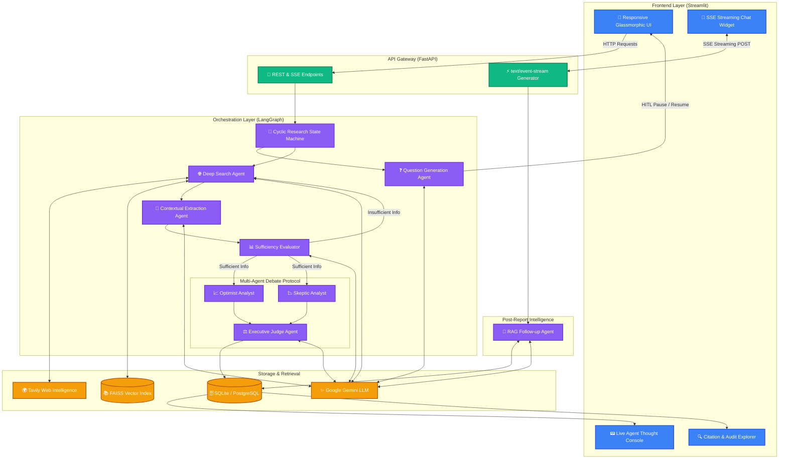
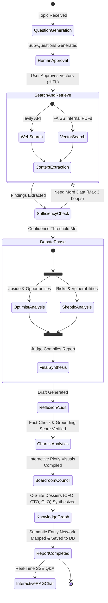

# Nexus AI: Autonomous Enterprise Research Agent 🧠

<div align="center">

[](https://www.python.org/)
[](https://fastapi.tiangolo.com/)
[](https://streamlit.io/)
[](https://langchain-ai.github.io/langgraph/)
[](https://ai.google.dev/)
[](https://github.com/facebookresearch/faiss)

**An enterprise-grade autonomous research platform featuring cyclic multi-agent orchestration, dialectical debate synthesis, real-time SSE token streaming, and citation auditability.**

[🚀 Live Streamlit App](https://enterprise-research-agent-nzp42bp4cvdaeaaoybprqi.streamlit.app/) • [API Documentation (Swagger)](http://127.0.0.1:8000/docs) • [Architecture](#-system-architecture) • [Key Capabilities](#-key-capabilities)

</div>

---

## 📌 Executive Summary

**Nexus AI** is an autonomous intelligence gathering and report synthesis engine designed to emulate human analyst workflows. Unlike naive single-prompt LLM wrappers, Nexus uses a **decoupled asynchronous architecture** powered by **LangGraph cyclic state machines**, a **Multi-Agent Debate Protocol (Optimist vs. Skeptic vs. Judge)**, **Hybrid RAG** (Private FAISS PDFs + Live Tavily Web Search), and **real-time Server-Sent Events (SSE) token streaming**.

---

## 🌟 Key Capabilities & Recruiter Spotlights

### 1. ⚡ Real-Time Token Streaming (The ChatGPT Effect)
- Implemented **Server-Sent Events (SSE)** via FastAPI's `StreamingResponse(media_type="text/event-stream")`.
- Real-time word-by-word typewriter rendering in Streamlit using native `st.write_stream` and chunk generators.
- Built-in graceful fallbacks ensuring zero UI disruption during transient network reconnects.

### 2. 💬 Interactive "Chat with Report" (Grounded RAG)
- Completed reports are immediately queryable via an integrated conversational agent.
- Grounded strictly in the report findings and original `[SRC-X]` source extracts to eliminate hallucination.
- Maintains multi-turn context history with per-topic session state isolation.

### 3. 🧠 Real-Time Agent Thought Console
- Transparent audit trail displaying real-time agent internal reasoning and state transitions (`q_gen` ➔ `search` ➔ `extract` ➔ `eval` ➔ `debate` ➔ `report_gen`).
- Auto-refreshing execution console in the Streamlit frontend with persistent logging in SQLite.

### 4. ⚖️ Multi-Agent Dialectical Debate Engine
- Final reports are synthesized via a 3-agent adversarial debate:
  - **Optimist Agent**: Highlights growth vectors, market upside, and positive potential.
  - **Skeptic Agent**: Stress-tests assumptions, identifying systemic risks, limitations, and worst-case scenarios.
  - **Judge Agent**: Synthesizes the debate into a balanced, executive-grade intelligence briefing.

### 5. 🔍 Deterministic Citation Explorer (Auditability)
- Every claim is assigned a unique `[SRC-X]` tag linked to the exact source chunk extracted from the web or internal documents.
- Includes a dedicated Citation Explorer enabling compliance teams to verify source snippets side-by-side.

### 6. 👤 Human-in-the-Loop (HITL) Research Steering
- After analyzing the initial prompt, the agent generates sub-questions and pauses execution in an `awaiting_approval` state.
- Analysts can refine, add, or prune research vectors before the search and extraction pipeline begins.

### 7. 🪞 Self-Reflective Auditor Agent (Reflexion Pattern)
- An independent **Auditor Agent** audits the synthesized report draft line-by-line against verified `[SRC-X]` ground truth findings.
- Calculates a mathematical **Grounding Precision Score (0-100%)** and assigns an official compliance audit verdict displayed as a verification stamp in the UI.

### 8. 📊 Dynamic Data & Plotly Chart Visualizer Agent (Chartist Agent)
- An autonomous **Chartist Agent** analyzes numerical, statistical, and horizon claims across the findings.
- Dynamically generates interactive **Plotly charts** (Strategic Impact Bar Charts & Commercial Adoption Horizon Curves) rendered inside the report.

### 9. 🏛️ Executive Boardroom Mode (Council of Expert Personas)
- Convenes a heterogeneous C-suite advisory panel:
  - 💼 **CFO Agent**: Evaluates 3-year ROI horizons, CAPEX/OPEX intensity, and capital allocation risks.
  - 🔬 **CTO Agent**: Assesses architectural feasibility, scalability bottlenecks, and engineering complexity.
  - ⚖️ **Chief Legal & Compliance Officer (CLO)**: Audits global regulatory compliance (EU AI Act, GDPR, SEC, IP exposure).
- Synthesizes an authoritative **Board Consensus Verdict** with structured executive dossiers.

### 10. 🌳 Interactive Knowledge Graph & Entity Relationship Visualizer
- An autonomous **Knowledge Graph Agent** maps semantic entity clusters, technological dependencies, and regulatory influences.
- Generates a dynamic 2D/3D Plotly interactive network graph with custom glowing entity nodes, directional relation edges, and category filters.

### 11. 🎧 Multi-Modal 60-Second Audio Executive Briefing
- Ingests the synthesized report and produces a spoken 60-second executive audio briefing playable directly in the browser via `st.audio`.

### 12. 📂 Multi-Modal Hybrid RAG (FAISS + Tavily)
- Upload proprietary enterprise PDFs to a local FAISS vector store.
- Agents dynamically blend internal proprietary context with live real-time web search.

### 13. 🌓 Modern Dual-Theme UI
- Bespoke Streamlit frontend engineered with custom CSS, glassmorphism, responsive KPI metric dashboards, 1-click **Dark / Light Theme Toggle**, and **Executive Export Center (.md & .txt)**.

---

## 🏗️ System Architecture



---

## 🔄 LangGraph Autonomous State Machine Workflow



---

## 🔌 API Reference

| Method | Endpoint | Description | Protocol |
| :--- | :--- | :--- | :--- |
| `POST` | `/api/research` | Initiates research task and triggers Question Generation | REST JSON |
| `POST` | `/api/research/{id}/approve` | Submits HITL approved questions & starts execution graph | REST JSON |
| `GET` | `/api/research/{id}` | Polls pipeline status, logs, findings, sources, and report | REST JSON |
| `POST` | `/api/research/{id}/chat` | Synchronous RAG grounded Q&A on completed report | REST JSON |
| `POST` | `/api/research/{id}/chat/stream` | **Real-Time Token Streaming** follow-up Q&A | **SSE (`text/event-stream`)** |
| `POST` | `/api/upload_documents` | Embeds uploaded PDF documents into FAISS vector store | Multipart Form |

---

## 🛠️ Technology Stack

| Layer | Technologies | Rationale |
| :--- | :--- | :--- |
| **Agent Orchestration** | LangGraph, LangChain Core | Enables cyclic loops, state persistence, conditional branching, and HITL interruptions |
| **LLM Engine** | Google Gemini (`gemini-flash-lite-latest`) | High-speed inference, massive token context window, and robust rate-limit margins |
| **Backend Framework** | FastAPI, Uvicorn, Pydantic v2 | High-throughput async performance with native Server-Sent Events (SSE) streaming |
| **Vector Store** | FAISS, HuggingFace Sentence Transformers | Fast in-memory similarity search for local enterprise document ingestion |
| **Web Retrieval** | Tavily Python API | Search engine optimized specifically for AI agent contextual retrieval |
| **Database & ORM** | SQLite / SQLAlchemy | Lightweight transactional database tracking task states, findings, sources, and logs |
| **Frontend UI** | Streamlit, Custom CSS3 | Fast, interactive dashboard with custom dark/light glassmorphism and streaming UI |
| **Deployment** | Render (Backend), Streamlit Cloud (Frontend) | Auto-deploying CI/CD pipelines connected to GitHub repository |

---

## 🚀 Getting Started (Local Development)

### 1. Prerequisites
- Python 3.11+
- [Google Gemini API Key](https://aistudio.google.com/)
- [Tavily API Key](https://tavily.com/)

### 2. Clone Repository & Setup Virtual Environment
```bash
git clone https://github.com/Anchalgupta1321/enterprise-research-agent.git
cd enterprise-research-agent

# Create & activate virtual environment
python -m venv venv
source venv/bin/activate  # On Windows: venv\Scripts\activate

# Install dependencies
pip install -r backend/requirements.txt
```

### 3. Environment Variables
Create a `.env` file in the project root:
```env
GEMINI_API_KEY="your-gemini-api-key"
TAVILY_API_KEY="your-tavily-api-key"
DATABASE_URL="sqlite:///./research_agent.db"
```

### 4. Run Backend Server
```bash
uvicorn backend.main:app --reload --port 8000
```
- API Docs: `http://localhost:8000/docs`

### 5. Run Frontend Application
In a separate terminal window:
```bash
# Set backend URL if running locally
export API_BASE_URL="http://127.0.0.1:8000/api"  # On Windows: $env:API_BASE_URL="http://127.0.0.1:8000/api"
streamlit run frontend/app.py
```
- Web Application: `http://localhost:8501`

---

## 👨‍💻 Author & Engineering Contact

Developed as an advanced AI engineering portfolio demonstrating **Agentic AI Systems**, **LangGraph Orchestration**, **Full-Stack Streaming (SSE)**, and **Enterprise RAG Architectures**.

- **Author**: Anchal Gupta
- **GitHub**: [@Anchalgupta1321](https://github.com/Anchalgupta1321)
- **Repository**: [enterprise-research-agent](https://github.com/Anchalgupta1321/enterprise-research-agent)

Feel free to star ⭐ the repository if you find this project valuable!
