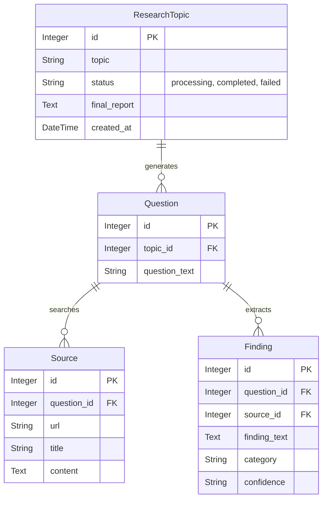

# Enterprise AI Research Agent - Technical Documentation

## 1. System Architecture

The system is built on a modern, decoupled client-server architecture using Python. It leverages asynchronous task queues to handle long-running LLM workflows without blocking the user interface.

```mermaid
graph TD
    subgraph Frontend [Streamlit UI]
        A[User Interface] -->|HTTP POST /api/research| B(API Gateway)
        A -->|HTTP GET /api/research/{id}| B
    end

    subgraph Backend [FastAPI Server]
        B --> C{Router}
        C -->|Trigger| D[Background Task Worker]
        C -->|Query Status| E[(SQLite Database)]
    end

    subgraph AI Pipeline [Autonomous Orchestrator]
        D --> F[1. Question Generation Agent]
        F --> G[2. Deep Web Search Agent]
        G --> H[3. Contextual Extraction Agent]
        H --> I[4. Contradiction Detection Agent]
        I --> J[5. Report Synthesis Agent]
        
        F <--> K[Gemini Flash Lite Model]
        H <--> K
        I <--> K
        J <--> K
        
        G <--> L[Tavily Search API]
    end

    D -->|Writes Results| E
    H -->|Stores Vectors| M[(FAISS Vector Database)]
```

### Component Breakdown:
*   **Frontend**: Streamlit provides a reactive, single-page application experience. It polls the backend for real-time status updates of the background agents.
*   **Backend**: FastAPI acts as the high-performance API layer. It handles synchronous user requests and offloads heavy AI tasks to `BackgroundTasks`.
*   **Orchestrator**: A multi-agent sequential pipeline built with LangChain. Each step is handled by a specialized agent using the `gemini-flash-lite-latest` model.
*   **Database**: SQLite is used for persistent transactional storage (tracking task status, storing raw findings, and the final report).
*   **Vector Store**: FAISS is used for semantic storage of extracted findings, enabling future RAG (Retrieval-Augmented Generation) capabilities.

---

## 2. Database & Data Model (ER Diagram)

The system uses a relational schema to track the hierarchical relationship between a broad research topic, its sub-questions, the sources found on the web, and the specific facts extracted from those sources.



### Table Details:
*   **ResearchTopic**: The root entity representing the user's initial prompt. It acts as the central tracker for the background job's status.
*   **Question**: Sub-queries generated by the AI to break down the complex topic into searchable chunks.
*   **Source**: Raw web pages retrieved by the Tavily Search API for a specific question.
*   **Finding**: Atomic facts extracted from the sources by the LLM, categorized and scored for confidence.

---

## 3. Rate Limiting & Resilience Engineering

A significant engineering challenge in this architecture was handling the strict API rate limits imposed by free-tier LLM providers.

To ensure enterprise-grade stability, the following resilience mechanisms were implemented:
1.  **Exponential Backoff**: The LLM caller (`robust_invoke`) is wrapped in a custom retry loop that intercepts `429 RESOURCE_EXHAUSTED` errors, parses the exact required wait time from the API response, and sleeps the background thread before resuming.
2.  **Throttling**: The Contextual Extraction agent utilizes deliberate buffer sleeps (`time.sleep(6)`) to mathematically prevent the pipeline from exceeding 10 requests per minute.
3.  **Thread Isolation**: Database connections (`SessionLocal`) are strictly isolated within the background thread's execution context to prevent SQLite database locking when the API forces the thread to sleep.

---

## 4. API Documentation

Because the backend is built with FastAPI, comprehensive API documentation (OpenAPI/Swagger UI) is automatically generated.

When the backend server is running locally, the interactive API documentation can be accessed at:
**`http://localhost:8000/docs`**

### Key Endpoints:
*   `POST /api/research`: Accepts a JSON payload `{"topic": "..."}`, creates a database entry, spawns the background worker, and returns the Task ID immediately.
*   `GET /api/research/{topic_id}`: Returns the current status of the task, and if completed, the full markdown string of the final synthesized report.
